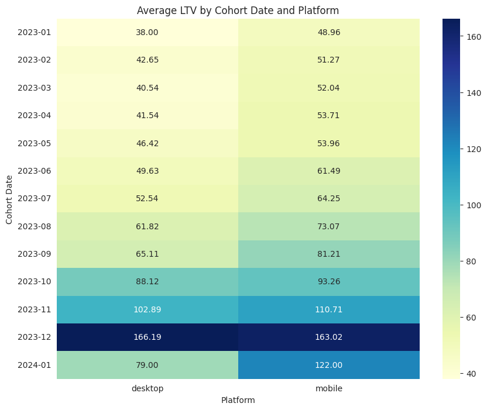
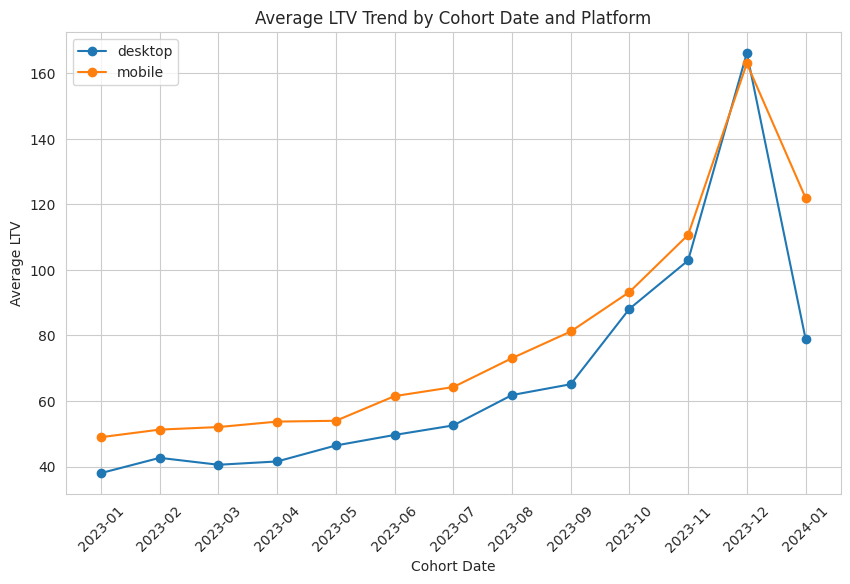

# Customer Cohort LTV Analysis

## Overview

This project performs a cohort analysis to calculate the Lifetime Value (LTV) of customers in an ecommerce dataset over the first 10 days after their initial purchase. The analysis is grouped by cohort (month of the first purchase), platform (mobile/desktop), and product category. The goal is to understand how LTV varies across different cohorts, platforms, and categories.

## Dataset

- **File**: `customer_orders.csv` (not included due to privacy; you can use your own ecommerce dataset with similar structure)
- **Columns**:
  - `order_id`: Unique order identifier
  - `customer_id`: Unique customer identifier
  - `order_date`: Date of the order
  - `order_amount`: Amount of the order
  - `platform`: Platform used (mobile/desktop)
  - `category`: Product category (e.g., smartphones, laptops)

## Steps

1. Load and preprocess the data (convert dates, handle categorical variables).
2. Identify the first purchase date for each customer.
3. Create cohorts based on the month of the first purchase.
4. Calculate the number of days since the first purchase for each order.
5. Filter orders within 10 days of the first purchase.
6. Compute cohort sizes (number of unique customers) and total revenue.
7. Calculate average LTV (revenue per customer) for each cohort.
8. Analyze the results and visualize them using a heatmap and a line plot.

## Key Findings

- The cohort with the highest LTV is "2023-12, desktop" with an average LTV of 166.19, closely followed by "2023-12, mobile" with an average LTV of 163.02.
- Average LTV on mobile is ~79.15, while on desktop it is ~67.24, confirming that mobile users tend to have a higher LTV.
- LTV shows a general upward trend from January 2023 to December 2023 for both platforms, with a peak in December 2023, followed by a decline in January 2024.

## How to Run

1. Clone the repository:
   ```bash
   git clone https://github.com/MykytaSalykin/Customer-Cohort-LTV-Analysis.git
   ```
2. Install the required libraries:
   pip install pandas numpy matplotlib seaborn
3. Place your customer_orders.csv file in the project directory.
4. Open and run the customer_cohort_ltv_analysis.ipynb notebook in Jupyter or Google Colab.

## Visualizations

- **Heatmap**: Shows average LTV by cohort date and platform.
  

- **Line Plot**: Shows the trend of average LTV over cohort dates for each platform.
  

## Author

- Mykyta Salykin
